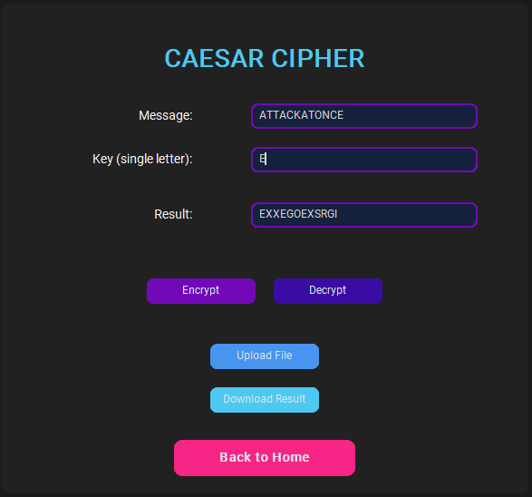

# 🔐 Cryptography System - Encryption & Decryption Toolkit

## 📌 Project Overview
This project is a **Graphical User Interface (GUI) application** that demonstrates various **classical and modern cryptographic algorithms**.  
It enables users to **encrypt and decrypt text or files**, visualize results, and understand how symmetric and asymmetric encryption work in real-time.

The tool is designed as a **practical cybersecurity learning project**, combining multiple cryptographic techniques into one modern, interactive system.

---

## 🚀 Key Features
- ✅ Modern **customtkinter-based GUI** with smooth navigation.
- ✅ Multiple **encryption and decryption algorithms** in one place.
- ✅ **File encryption support** with upload and download options.
- ✅ Includes **both symmetric and asymmetric cryptography**.
- ✅ User-friendly design with **real-time results** display.
- ✅ Scalable architecture for adding new algorithms easily.

---

## 🔑 Supported Algorithms

### 🔹 Symmetric Ciphers
- Caesar Cipher
- Substitution Cipher
- Transposition Cipher (Row & Column)
- Hill Cipher
- ROT13
- Affine Cipher
- Rail Fence Cipher
- Playfair Cipher

### 🔹 Asymmetric Ciphers
- RSA (Public & Private Key Encryption)
- Diffie-Hellman Key Exchange

---

## 🛠 Tech Stack
- **Language:** Python 3.14+
- **GUI Framework:** customtkinter, tkinter
- **Cryptographic Libraries:** `Crypto`, `math`, `binascii`, `random`
- **File Handling:** `filedialog`, `messagebox`
- **Version Control:** Git & GitHub

---

## ⚙️ Main Functions

### 1️⃣ GUI Functions
- `create_nav_button()` – Creates main navigation buttons.
- `create_action_button()` – Buttons for Encrypt / Decrypt.
- `create_entry()` – Input fields for text and keys.
- `create_label()` – Label fields for user guidance.
- `clear_frame()` – Clears the frame to display a new screen.

### 2️⃣ Core Encryption Functions
- `encrypt_caesar()` / `decrypt_caesar()`
- `encrypt_substitution()` / `decrypt_substitution()`
- `encrypt_transposition()` / `decrypt_transposition()`
- `encrypt_hill()` / `decrypt_hill()`
- `encrypt_rot13()`
- `encrypt_affine()` / `decrypt_affine()`
- `encryptRailFence()` / `decryptRailFence()`
- `encryptByPlayfairCipher()` / `decryptByPlayfairCipher()`
- `generateKeys()` / `rsa_operation()` (RSA)
- `calculate_diffie_hellman()` (Key Exchange)

### 3️⃣ Utility Functions
- `download_file()` – Save encrypted/decrypted output to a file.
- `upload_file()` – Load a file to process its content.
- `mod_inverse()` – Compute modular inverse (used in RSA & Hill).
- `power()` – Modular exponentiation (RSA & Diffie-Hellman).
- `gcd()` – Greatest common divisor calculation.

---

## 🎮 How It Works
1. **Splash Screen:** Attractive loading screen before main GUI.
2. **Algorithm Selection:** Choose desired encryption/decryption method.
3. **Data Input:**
   - Enter text or upload a `.txt` file.
   - Enter encryption/decryption key (if required).
4. **Operation:** Click **Encrypt** or **Decrypt**.
5. **Output:** The result is displayed with the option to download.
6. **Switch Algorithm:** Navigate to another cipher or return to main menu.

---

## 🎯 Educational Purpose
- Designed as a **cybersecurity learning tool** for students and professionals.
- Covers the most **common symmetric and asymmetric encryption algorithms**.
- Helps visualize encryption processes and key exchanges step by step.

---

## 🚀 Future Enhancements
- Add modern encryption standards like **AES, DES**.
- Enable encryption for other file types (images, PDFs, etc.).
- Add **key management system** for RSA and Diffie-Hellman.
- Implement graphical flowcharts showing encryption steps.
- Integrate a **built-in explanation panel** for each algorithm.

---

## 📂 Project Structure

---

# 💻 UI Preview

